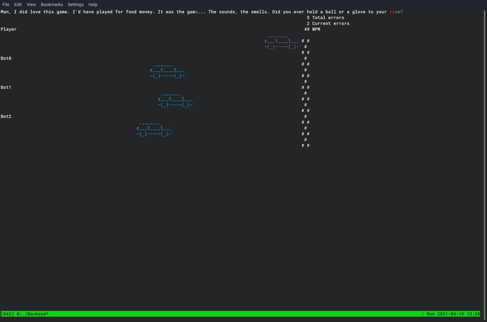
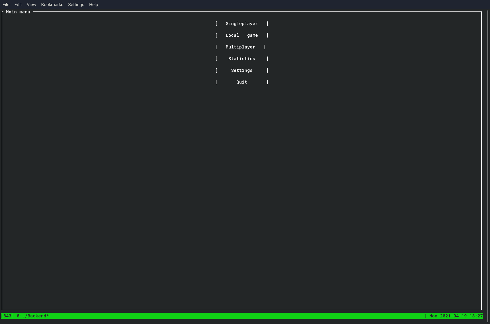
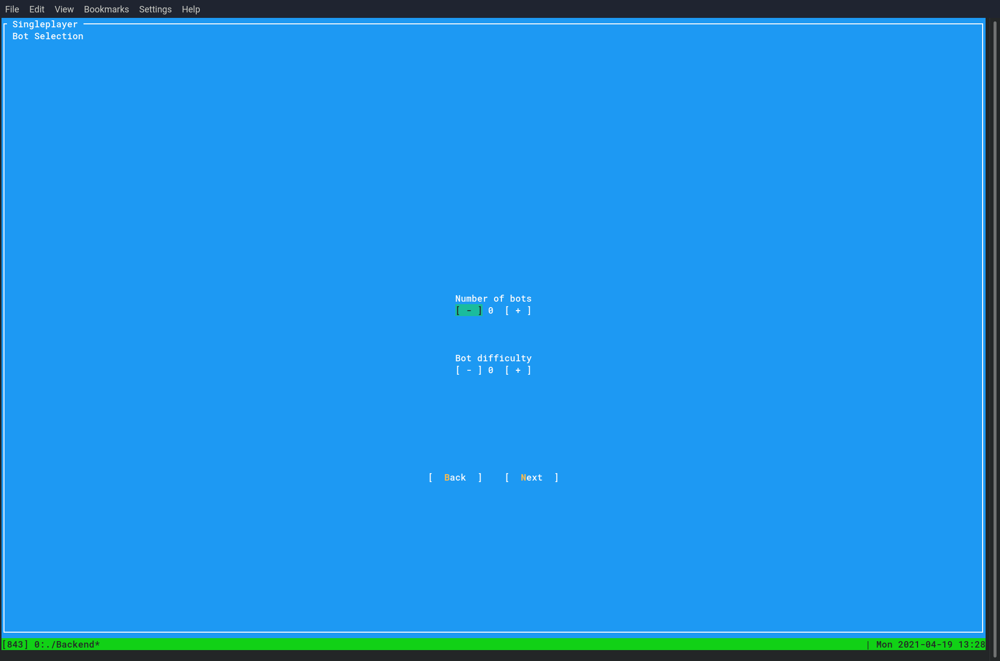
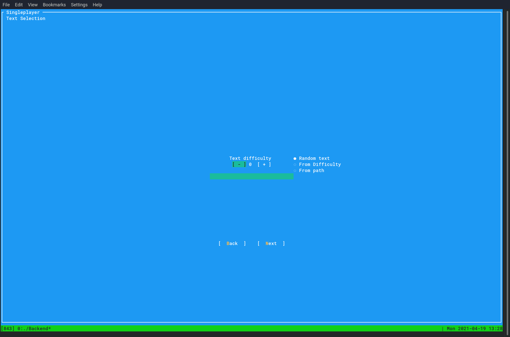
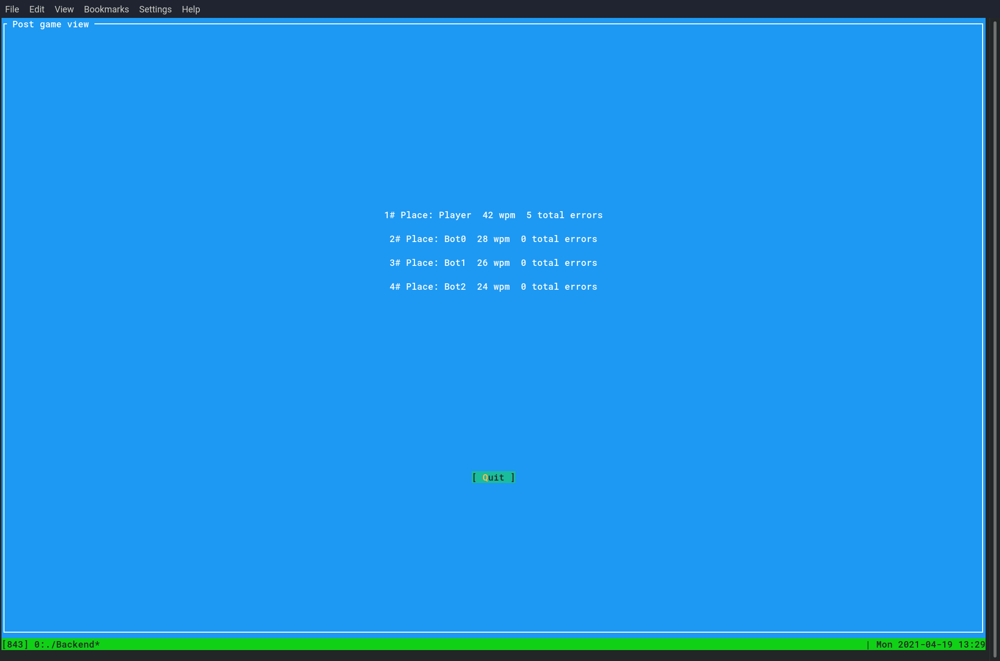

# Keyboard Racer
A Terminal-based typing game inspired by [Type Racer](https://play.typeracer.com/).

## Main menu

## Bot selection
- Allows playing against 0 to 4 bots
- Bot difficulty ranges from 0 to 9

## Text selecion
- Random text
- Text closest to specified relative difficulty in the range of 0(easiest) to 100(hardest)
- Content of file at specifed path

## Ingame view

- Highlighting of
  - untyped characters(dark gray)
  - typed correctly typed characters(light gray)
  - incorrectly typed characters(red)
- Display of statistics
  - Number of total errors made so far
  - Number of errors in the current state of the text
  - Current typing speed measured in *Words per minute*(WPM)
- Visualization of the participants progress through a car race
  

## Post game view

Participants ranking with typing speed and total number of errors made

## Acknowledgement
Text database taken from http://typeracerdata.com/texts.

UI built with Gui.cs https://github.com/migueldeicaza/gui.cs.

ASCII banners built with https://patorjk.com/software/taag.